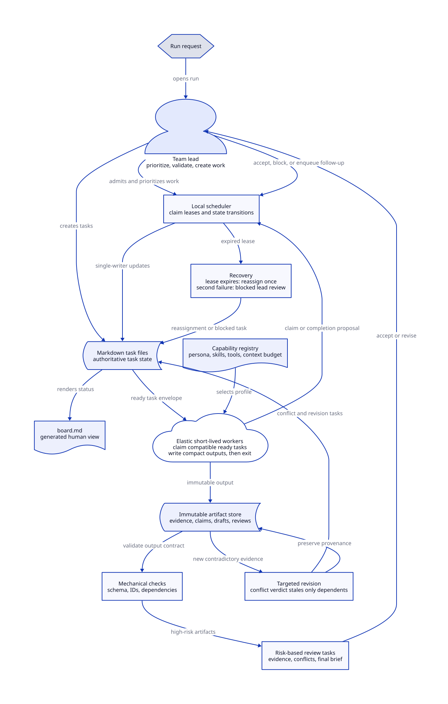
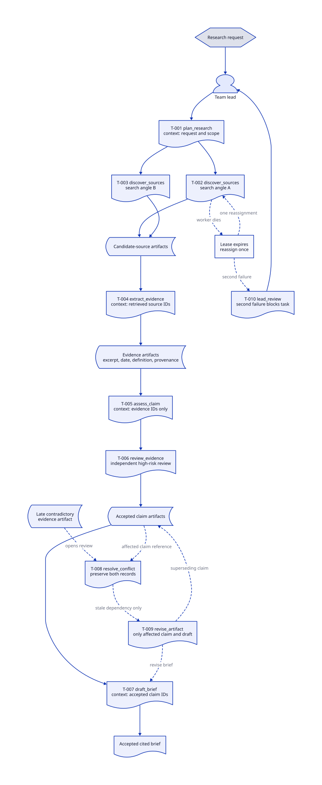

# Task-Board Swarm Architecture

The system uses a lightweight, file-backed control plane with short-lived
Strands workers. It is deliberately not a shared-conversation swarm: workers
coordinate through durable task and artifact records instead of inheriting a
growing prompt history.



Editable source: [task_board_swarm_architecture.d2](../artifacts/task_board_swarm_architecture.d2).

## Execution model

The team lead owns run-level decisions: it decomposes the request, controls
priority and parallelism, accepts validated work, and opens follow-up tasks.
The local scheduler is the only writer of task-state transitions. It grants a
lease when a compatible worker claims ready work and records recovery after a
lease expires.

Workers are short-lived Strands agents selected from a capability registry.
Each task type requires capabilities instead of a fixed named worker. The
registry resolves those capabilities to a persona, explicit approved skills and
tools, and a context budget. A worker receives only its task envelope and the
listed artifact IDs; it writes an immutable output artifact, proposes
completion, and exits.

The runner remains host-local and owns durable run state. Every worker agent
receives a Strands Docker sandbox and no generic shell or file-editor tool. The
sandbox adds a second boundary around worker tools without giving the runner
Docker-socket privileges.

## Markdown task board

Markdown task files are the authoritative local state. `board.md` is a derived
human-readable view, not a concurrent edit target. A run uses this layout:

```text
run/
  board.md
  tasks/T-001-plan.md
  tasks/T-002-discover-primary-sources.md
  artifacts/E-001-source-extract.md
  events.md
```

Each task has YAML front matter with `id`, `type`, `status`, `depends_on`,
`priority`, `lease`, `attempt`, `required_capabilities`, `input_artifacts`,
`output_contract`, and `review_required`. The body holds the human-readable
instruction and acceptance criteria.

The scheduler is the only component allowed to update a task file's status.
Workers submit claim and completion proposals, avoiding write conflicts while
keeping every durable state record inspectable as Markdown.

## Lifecycle, validation, and recovery

Normal lifecycle is `pending`, `ready`, `claimed`, `awaiting_review`, then
`complete`. Exceptional states are `blocked`, `failed`, `stale`, and
`cancelled`.

Workers self-check their output. Mechanical validation checks schemas, artifact
IDs, dependencies, and allowed transitions. Evidence, conflict decisions, and
the final brief additionally receive independent review tasks. The team lead
accepts or rejects the reviewed output.

If a lease expires, the scheduler reassigns the task once. A second failure
marks it blocked and creates lead-review work. New contradictory evidence is
stored without overwriting prior evidence. The lead queues `resolve_conflict`;
only that task's verdict marks dependent claims or drafts stale and creates
focused revision tasks.

## Research-brief trace



Editable source: [research_brief_execution_trace.d2](../artifacts/research_brief_execution_trace.d2).

The trace keeps the flow concrete while the generic diagram explains how the
same task-board mechanism supports another domain.
