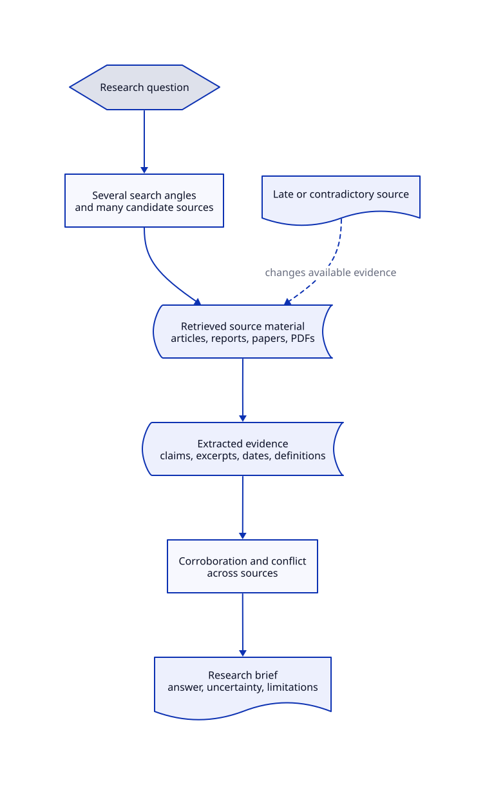

# Research Brief Exercise

## Problem

Take a research question, gather and cross-check sources, and write a short cited brief.

The exercise is about running the research over a sufficiently large and messy body of evidence that a single uninterrupted context is not enough to handle it reliably.

## Conceptual Flow

Editable source: [conceptual_research_workflow.d2](../artifacts/conceptual_research_workflow.d2).

## Execution Architecture

The conceptual flow above describes the research problem. The concrete
task-board swarm architecture and an end-to-end research execution trace are
documented in [Task-Board Swarm Architecture](ARCHITECTURE.md).

## Research Question

The specific question will be chosen before a run. It should be:

- bounded enough to answer in a short brief;
- broad enough to require many sources and several search angles;
- likely to produce sources that disagree, become outdated, or overlap.

## Research Request

Each run supplies a general research request rather than relying on a fixed topic:

| Field | Required | Meaning |
| --- | --- | --- |
| Question | Yes | The question the brief must answer. |
| Audience | No | Who will read the brief and their expected level of detail. |
| Brief length | No | A target word count or a short/medium/long instruction. |
| Scope | No | Jurisdictions, populations, time period, or definitions to include or exclude. |
| As-of date | No | The latest date evidence may cover. |
| Source guidance | No | Preferences such as primary sources, peer-reviewed research, official statistics, or recent reporting. |
| Output format | No | A requested structure, such as recommendation, comparison, or neutral evidence summary. |

When optional fields are omitted, the system should state the assumptions it used in the final brief.

## Inputs

- A research request.
- Live web results and the source material reached from those results.

## Available Research Tools

The problem provides ordinary research capabilities:

| Tool | What it does |
| --- | --- |
| Web search | Finds candidate sources for a query. |
| Source retrieval | Opens a chosen URL and returns its response or an error. |
| Text extraction | Produces usable text and excerpts from retrieved HTML or PDF content. |
| Writing | Produces the final Markdown brief and citations. |

Search results, retrieved pages, and extraction output may be incomplete, duplicated, noisy, or inconsistent.

## Evidence Expectations

The brief should prefer the strongest available evidence for each material claim:

- Prefer primary sources, official data, original research, and direct documentation when they are available.
- Use secondary reporting for context, interpretation, or discovery, and distinguish it from the underlying source.
- Treat a search-result snippet as discovery material, not as support for a claim.
- Cite a retrieved source for each material factual claim, using enough metadata for a reader to locate it.
- Preserve disagreements rather than forcing a single conclusion when credible sources conflict.
- Distinguish evidence published after the request's as-of date from eligible evidence.

The task does not require a fixed number of sources. It requires enough independent, relevant support to make the scope and uncertainty of the answer clear.

## Required Output

A short brief that:

- answers the research question directly;
- distinguishes well-supported findings from uncertainty or disagreement;
- cites the sources supporting its material claims; and
- identifies important limitations in the available evidence.

## Conditions That Make the Run Interesting

The source material should include realistic complications:

- several plausible search queries and many candidate sources;
- duplicate reporting or sources that repeat the same underlying claim;
- primary and secondary sources of mixed quality;
- conflicting statistics, definitions, or dates;
- inaccessible, malformed, or partially extracted pages;
- a late-discovered source that materially changes an earlier conclusion.

The intended scale is large enough that the work must be divided and later brought back together without losing source provenance or confusing unsupported claims for established findings.

## Out of Scope

This document does not prescribe the number or type of workers, the shared-state design, the model provider, or the orchestration strategy. Those are the design decisions the implementation should demonstrate and defend.
